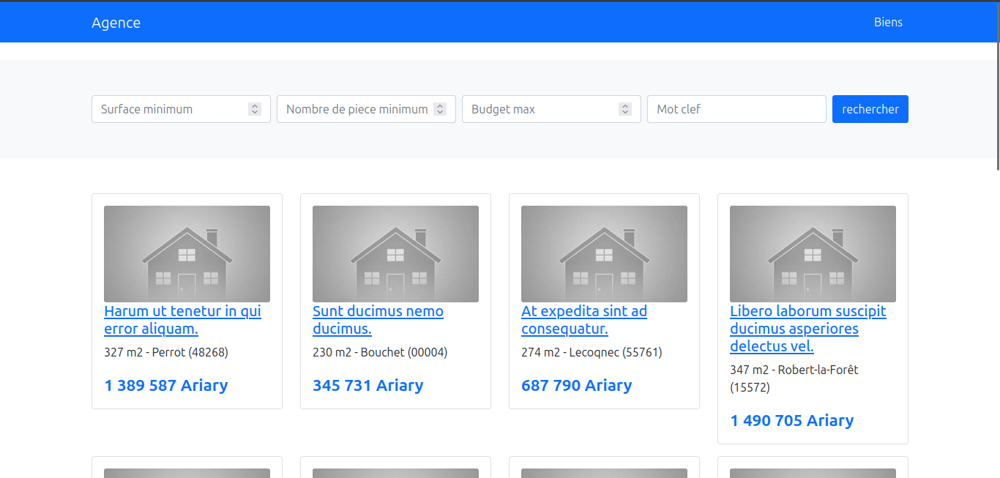

# Mon Agence
 
Mon Agence is a project to practice Laravel 10, it is a list of owners for the customers page and a search bar to filter the properties, an adim page to administer the properties



## Installation:

- Clone the repository from Github:
  ```
  git clone https://github.com/97mams/monAgence
  ```
- Install dependencies:
  ```
  composer install
  ```
  and
  ```
  npm install
  ```
- Change .env :
  ```
  DB_DATABASE=agence
  ```
- Update database:
  ```
  php artisan migrate
  ```
- Refresh database:
  ```
  php migrate:fresh --seed
  ```
- Run server:
  ```
  php artisan serve
  ```